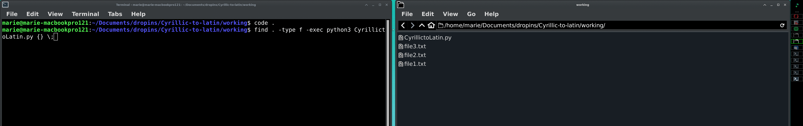
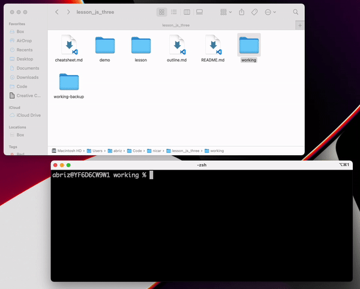

# Description

This project aims at transliterating files from serbian cyrilic alphabet to latin alphabet.
- Example:
```
   Снаге генерала Михаиловића, уз сарадњу српског народа,
-> Snage generala Mihailovića, uz saradnju srpskog naroda,
```

# Usage
If you already have a text in the txt format you can use directly the python script


1. Download Cyrillic2latin.zip and extract it to a folder.
2. Search for Terminal.app in Spotlight (⌘+SPACE), then open it.
3. In the Terminal window, type cd , press the SPACE key, then drag and drop the extracted folder into the window, then press the RETURN key.



4. Write the following command to convert all your files in the folder (and all the folders below it):
```
find . -type f -exec python3 CyrillictoLatin.py {} \;
```


# References

Script has been forked from [https://github.com/mardub1635/Cyrillic-to-latin](https://github.com/mardub1635/Cyrillic-to-latin)

The gif comes from the [Tutorial to learn terminal](https://github.com/brizandrew/nicar-2022-javascript-103/blob/5492890c1d7e52ea8f5c5b31fe98107dbe15a51d/lesson/1%20–%C2%A0The%20Command%20Line.md)

# Authors:
Original project of [Tomislov Dulic](https://www.katalog.uu.se/profile/?id=N96-5917). [Drop in contact](https://www.abm.uu.se/cdhu-eng/contact-eng/) at CDHU
Engineer:
Marie Dubremetz
Website:
[http://www.mariedubremetz.com](http://www.mariedubremetz.com)
Gitlab:
[@mardub](https://gitlab.com/mardub)
Github:
[@mardub1635](https://github.com/mardub1635)

e-mail:
mardubr-github@yahoo.com


